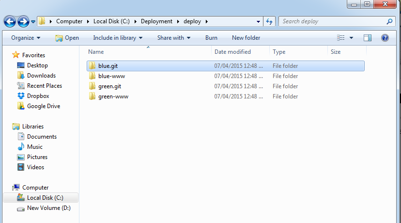
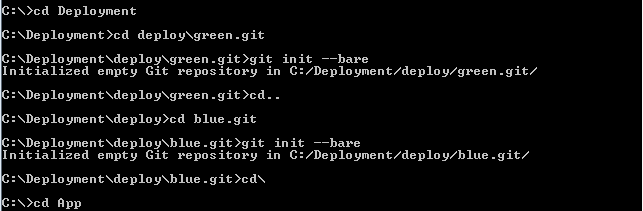
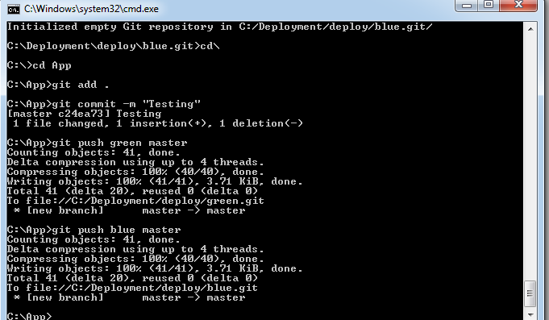
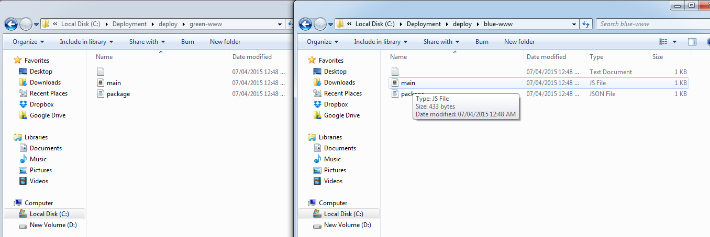
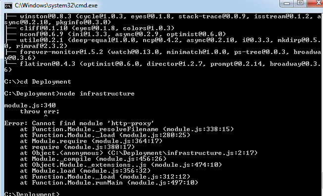

# CSC 591 HW4
----------------

Initially we create the folder structure as given in the figure:

We then initialize the git repositories and create bare repositories, which do not have working trees.

After cloning the app repo and setting up the git remotes, we get the results as follows:

Then on running 'node infrastructure', we can see that it does not run as there is no node_modules folder in the blue-www or green-www folder.

